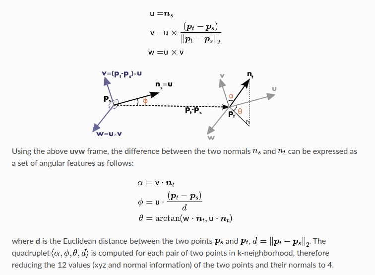
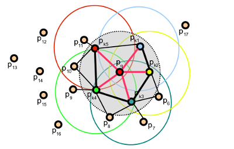
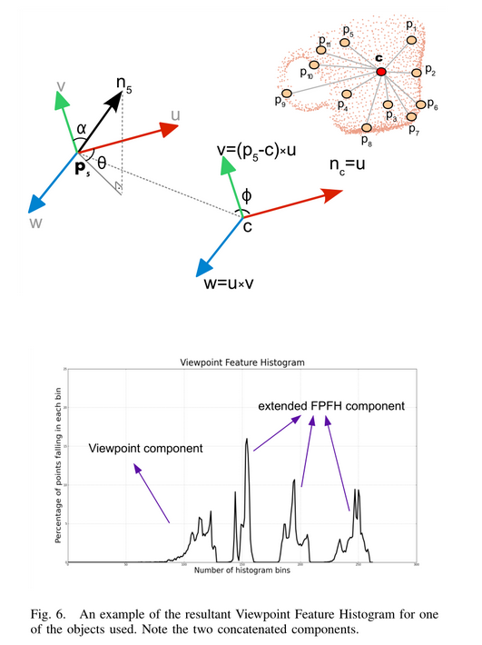
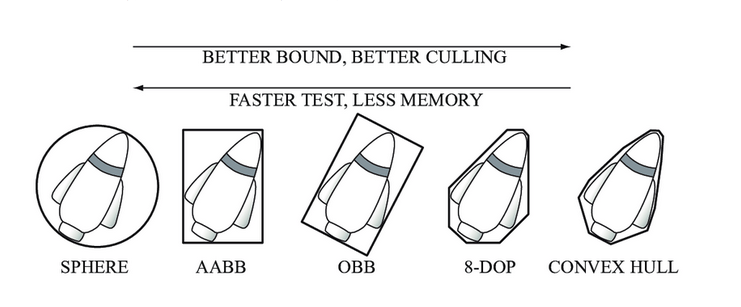

# PCL_TUTORIAL
此项目根据pcl库官方教程，对实例代码进行学习和复现
pcl官方教程：https://pcl.readthedocs.io/projects/tutorials/en/master/index.html

## 编译
``` bash
./make.sh
```
运行脚本，将自动编译并安装可执行文件

## pcl_viewer工具的一些使用方法
- 可视化法向量：
pcl_viewer -normals 1 ./your_path.pcd

## Basic Usage
### 使用旋转矩阵对点云进行变换
- pcl::transformPointCloud: 格式转换后会发生坐标轴映射错误，需要使用旋转矩阵进行线性变换

## Filtering 过滤异常值和噪声，体素化降采样，提取特征
1. pcl::PassThrough：输入点云，使用PassThrough模块，根据x,y或者z轴的数值范围过滤
2. pcl::VoxelGrid：输入点云，使用VoxelGrid模块体素化点云，取每一个体素内点的坐标平均值，也就是重心，作为该体素内的代表
3. pcl::StatisticalOutlierRemoval：输入点云，设置点云最临近数，计算距离其他点的高斯分布，设置标准差系数，大于该（标准差系数×标准差）的点将被过滤
4. pcl::ModelCoefficients，pcl::ProjectInliers：设置投影滤波模型和对象，将点云投影到一个对象上，例如一个平面或者球面之类的
5. pcl::SACSegmentation，pcl::ExtractIndices：设置分割对象和特征提取对象，例如将平面分割出来
6. pcl::RadiusOutlierRemoval,pcl::ConditionalRemoval:半径去除异常值，半径范围内最多保留多少个邻点；条件去除异常值，具体什么条件可以去除异常值，例如x轴大于2

## features 3D特征方法
### 理论前置
pcl使用近似的两种方法来找邻域点，k维快速最领域；考虑半径范围内的所有点；
#### 输入点云
setInputCloud(), setIndices(), setSearchSurface()总共有四种不同的输入情况
1. setIndices() = false, setSearchSurface() = false，输入单个点云，特征点云和搜索点云都是一个
2. setIndices() = true, setSearchSurface() = false，特征点云为indeces向量里的，搜索点云为全部
3. setIndices() = false, setSearchSurface() = true，特征点云为全部，单独设置邻域搜索点云
4. setIndices() = true, setSearchSurface() = true，单独设置特征点云向量和领域搜索点云
思路是，输入体素化，去掉噪声和异常值后的点云为特征向量，去噪声和异常值后的点云作为邻域搜索点云，一般常用的是setSearchSurface()设置特征值或者降采样后的点云为搜索表面
### 平面法向估计
尽管存在许多不同的法线估计方法，但我们将在本教程中重点介绍的方法是最简单的一种，即确定表面上一点的法线的问题可以通过估计与表面相切的平面的法线问题来近似，这又变成了最小二乘平面拟合估计问题。
#### 主成分分析PCA(Principal components analysis)
- 将坐标轴中心移到数据的中心，然后旋转坐标轴，使得数据在C1轴上的方差最大，即全部n个数据个体在该方向上的投影最为分散。意味着更多的信息被保留下来。C1成为第一主成分。
- C2第二主成分：找一个C2，使得C2与C1的协方差（相关系数）为0，以免与C1信息重叠，并且使数据在该方向的方差尽量最大。
- 以此类推，找到第三主成分，第四主成分……第p个主成分。p个随机变量可以有p个主成分。
- 在实际操作中，则为求协方差矩阵和特征向量，特征向量1和2则组成拟合平面，第三轴则为法向量。

#### 积分图的法向量估计(Normal Estimation Using Integral Images)
- 积分图的每一点（x, y）的值是原图中对应位置的左上角区域的所有值得和，将一张图片中的每一个像素点的取值替换为其（在原始图片中）左上角区域的所有像素值之和，就是积分图
- chatgpt解释，以下是积分图法估算法向量的基本原理和流程：
    1. 构建积分图：对于输入的深度图，先计算每个像素（或点）的积分值图。这使得可以在任意给定矩形区域内快速求和，这个特性是实现快速区域求和的关键。
    2. 邻域窗口计算：在积分图的帮助下，可以选择一个合适的窗口尺寸（例如 3x3 或 5x5）来确定每个点的局部邻域。积分图法允许我们快速计算该窗口内的点坐标和深度值的累积和。
    3. 法向量估算：根据局部邻域内的点，积分图法能够快速计算局部表面的梯度信息，进而通过主成分分析（PCA）或其他几何方法确定法向量。积分图法将这些计算简化为矩形区域累积和的计算，因此速度显著提升。
    4. 效率优势：积分图法的主要优势在于高效性，它使得在处理大规模点云（尤其是深度图生成的点云）时法向量估算变得可行。这种方法非常适合实时应用或资源受限的环境下进行法向量计算，例如移动设备或嵌入式系统。
    与传统的法向量估算方法（如直接计算邻域协方差矩阵进行PCA分析）相比，积分图法在计算复杂度上有明显的优势，特别适合规则网格采样（如深度图点云）的场景。
- 经过测试，该方法没有理论上的加速效果，因为PCA方法使用的api NormalEstimationOMP()方法能够使用多核加速，速度显著比使用单核的IntegralImageNormalEstimation()更快
### 点特征直方图(Point Feature Histograms (PFH))
- 多维直方图概括点周围的平均曲率，来编码点的k邻域几何属性，这种超空间的表示依赖于每一个点的法向量估计质量，直接关系到该表示法的质量
- 两个点法向量之间的特征可以表示如下：
- 
- 三个角度和两点之间的欧氏距离d组合成一个四联体，则为k近邻中两个点之间的PFH四元组特征
- 为了创建点的最终PFH表示，所有的四元数几何被合并到直方图中
```
//api函数,：
computePairFeatures (const Eigen::Vector4f &p1, const Eigen::Vector4f &n1,
                     const Eigen::Vector4f &p2, const Eigen::Vector4f &n2,
                     float &f1, float &f2, float &f3, float &f4);
PFHEstimation()
computePointPFHSignature()
```
- 例如，特征值pcl::PFHSignature125里包含125个float的数组，5的3次方，其中3是代表四元组特征中的前3个数值，也就是三个差值，5代表对每个维度划分成五个区域并将数据归类，最终125个数组中每一个数值代表当前域内点的个数

### 快速点特征直方图(Fast Point Feature Histograms(FPFH))
- 其他：关于FPFH(Fast Point Feature Histogram)，相比传统的PFH方法计算所有k邻域之间的三元组，该方法改为只计算查询点到邻域点的特征，以及领域点的邻域点的特征，如下图：
- 

### 视点特征直方图(Viewpoint Feature Histogram (VFH))
TODO:需要更细致的研究
- VFH依赖于FPFH描述符，在保持尺度不变性的同时添加视点变量，计算得到视点特征直方图
- VFH特征包含两部分：1.计算视点方向和所有点的法向量夹角直方图；2. 质心点到表面每个点的扩展FPFH特征


### 法线对齐径向特征(NARF)
TODO:需要研究

### 基于惯性矩和偏心率的描述符
TODO
- 包围体，包容盒，凸包


### 旋转投影统计特征(RoPS)
TODO

### 全局对齐空间分布描述符(GASD)
TODO

## Octree八叉树
- 分辨率：代表八叉树每个叶子节点所覆盖的空间边长，这意味着空间中所有被划分到该节点的点都在立方体内
- 空间变化检测，检测不同帧点云之间的不同

## 点云识别

## 点云配准

## 点云分割segmentation

## 点云表面处理
### 重采样平滑表面

### 建立投影后2d点云平面的凸或凹多边形
- 先将3D点云投影到2D平面，再计算2D平面点云的凹或者凸包

## 基于多项式重构的平滑和法向估计

## tips:PCL点云格式及其转换
- pcl::fromROSMsg: 将ros中的sensor_msgs::PointCloud2格式转换为目标格式，例如pcl::PointXYZ或者pcl::PointXYZRGB等，应该是使用模板函数实现
- pcl::toROSMsg: 作用与frmoROSMsg相反，将pcl格式的转换为ros格式并发送出去